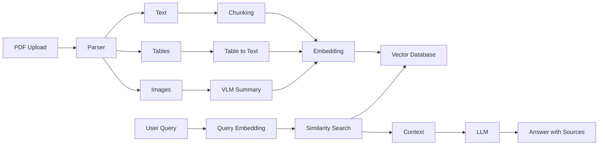

# bootcamp_assignment_01
## Multimodal RAG System with FastAPI

### Course: Multimodal Retrieval-Augmented Generation Bootcamp

## 6. Problem Statement

## 1. Domain Identification  
This project is based on the domain of **automotive engineering**, focusing on **engine design, diagnostics, and service engineering**. Engineers and technicians rely on workshop manuals (such as Hino engine manuals) to understand engine systems, perform troubleshooting, and carry out maintenance. These manuals include a combination of text, tables, and engineering diagrams.

---

## 2. Problem Description  
Extracting useful information from these manuals is difficult and time-consuming. The documents are large and contain detailed technical content such as torque specifications, fault codes, and subsystem explanations.

Engineers often need quick answers like:
- What is the torque value for a component?  
- What are the causes of a fault code?  
- How does a system like fuel injection work?  

Traditional keyword search is not effective because it does not understand the meaning of queries. It also cannot properly interpret tables or diagrams. As a result, users must manually search through multiple pages, which is inefficient and error-prone.

---

## 3. Why This Problem Is Unique  
Automotive manuals have domain-specific challenges:
- Use of specialised technical terms  
- Important data stored in structured tables  
- Engineering diagrams that explain system behavior  
- Information spread across different sections  

A complete answer often requires combining text, tables, and diagrams. This makes the problem more complex than a general document question-answering task.

---

## 4. Why RAG Is the Right Approach  
Retrieval-Augmented Generation (RAG) is suitable for this problem because it retrieves relevant information directly from documents at query time.

Key advantages:
- Provides answers based on actual documents  
- Reduces incorrect or hallucinated responses  
- Works with semantic search (understands meaning)  
- No need for retraining when adding new data  

A multimodal RAG system can also handle text, tables, and images together, allowing better and more complete answers compared to traditional methods.

---

## 5. Expected Outcomes  
The system will enable users to:
- Ask technical questions about engine systems  
- Retrieve values from tables like torque specifications  
- Understand information from diagrams  
- Get answers with proper source references  

This will reduce time spent on manual searching and improve accuracy in diagnostics and maintenance tasks. The goal is to make complex workshop manuals easy to use through a simple question-answer interface.

## Technology Choices

This system is designed with a focus on practical usability, cost efficiency, and ease of deployment, while still supporting multimodal capabilities required for automotive engineering documents.

---
----
-----
---

## 7. Architecture Overview

The system follows a modular Multimodal RAG architecture with two primary pipelines: ingestion and query processing.

### Ingestion Pipeline

When a PDF document is uploaded, it is parsed into three types of content:

* Text
* Tables
* Images

Each type is processed separately:

* Text is split into smaller chunks using recursive chunking
* Tables are converted into structured textual representations
* Images are passed through a vision-language model to generate descriptive summaries

All processed content is converted into vector embeddings and stored in a vector database along with metadata such as page number and content type.

### Query Pipeline

When a user submits a query:

1. The query is converted into an embedding
2. Relevant chunks are retrieved using similarity search
3. Retrieved context is passed to the LLM
4. The LLM generates a response grounded in the retrieved content
5. The system returns the answer along with source references

### Architecture Diagram



---

## 8. Technology Choices

### Document Parser — PyMuPDF

PyMuPDF was chosen because it provides direct and reliable extraction of text and images from PDF documents. It allows better control over parsing compared to higher-level frameworks and works efficiently for structured engineering manuals.

---

### Embedding Model — Sentence Transformers (all-MiniLM-L6-v2)

A local embedding model was selected to avoid API costs and improve performance. The chosen model provides good semantic understanding for technical content while being fast enough for large documents.

---

### Vector Store — ChromaDB

ChromaDB was selected due to its simplicity and built-in support for metadata filtering. It allows storing embeddings along with additional information like page number and content type, which is important for returning source references.

---

### LLM — Gemini / OpenRouter (Configurable)

An external LLM is used for response generation to ensure strong reasoning capabilities. The system is designed to be flexible so that different models can be used without changing the core pipeline.

---

### Vision Model — Gemini Vision

A vision-language model is used to convert diagrams into textual summaries. This ensures that image content becomes searchable and can be used during retrieval.

---

### Framework — Lightweight Custom + LangChain Utilities

A lightweight custom pipeline is used along with selected LangChain utilities. This avoids unnecessary complexity and keeps the system modular and easy to maintain.

---

### API Layer — FastAPI

FastAPI was chosen for its speed and simplicity. It provides automatic API documentation and integrates well with validation frameworks, making it suitable for production-style applications.

---

## 9. Setup Instructions

### 1. Clone Repository

```bash
git clone https://github.com/your-username/multimodal-rag-engine-system.git
cd multimodal-rag-engine-system
```

---

### 2. Create Virtual Environment

```bash
python -m venv venv
source venv/bin/activate   # Windows: venv\Scripts\activate
```

---

### 3. Install Dependencies

```bash
pip install -r requirements.txt
```

---

### 4. Configure Environment Variables

Create a `.env` file using `.env.example`

Example:

```
LLM_API_KEY=your_api_key_here
VISION_API_KEY=your_api_key_here
```

---

### 5. Run the Server

```bash
uvicorn main:app --reload
```

---

### 6. Access API

* Swagger UI: http://localhost:8000/docs
* Health Check: http://localhost:8000/health

---

### 7. Ingest Document

```bash
curl -X POST "http://localhost:8000/ingest" \
-F "file=@sample_documents/hino_manual.pdf"
```

---

### 8. Query System

```bash
curl -X POST "http://localhost:8000/query" \
-H "Content-Type: application/json" \
-d '{"query": "Explain turbocharger working"}'
```

---

## 10. API Documentation

### GET /health

Returns system status including number of indexed documents and uptime.

Example Response:

```json
{
  "status": "running",
  "documents_indexed": 1,
  "total_chunks": 1200,
  "uptime": "10 minutes"
}
```

---

### POST /ingest

Uploads and processes a PDF document.

Example Response:

```json
{
  "message": "Document ingested successfully",
  "text_chunks": 800,
  "table_chunks": 150,
  "image_chunks": 50,
  "processing_time": "25 seconds"
}
```

---

### POST /query

Accepts a natural language query and returns an answer with sources.

Example Request:

```json
{
  "query": "What is the torque specification for cylinder head?"
}
```

Example Response:

```json
{
  "answer": "The torque specification is 120 Nm...",
  "sources": [
    {
      "file": "hino_manual.pdf",
      "page": 45,
      "type": "table"
    }
  ]
}
```

---

### GET /docs

Provides Swagger UI for testing all endpoints.

---

## 11. Screenshots

The following screenshots demonstrate the working system:

* Swagger UI showing API endpoints
* Successful document ingestion
* Query result for text-based retrieval
* Query result for table-based retrieval
* Query result for image-based retrieval
* Health endpoint response

All screenshots are stored in the `screenshots/` directory.

---

## 12. Limitations & Future Work

### Limitations

* Image understanding depends on the quality of generated summaries
* Table conversion may lose some structural relationships
* Performance may reduce with very large documents
* No authentication or user access control implemented

---

### Future Work

* Improve table parsing using structured extraction methods
* Add evaluation metrics such as RAGAS
* Implement caching for faster query response
* Support multiple document filtering
* Add authentication and rate limiting
* Deploy using Docker for scalability

---

This system provides a strong foundation for handling multimodal engineering documents and can be extended further for production-grade deployment.
